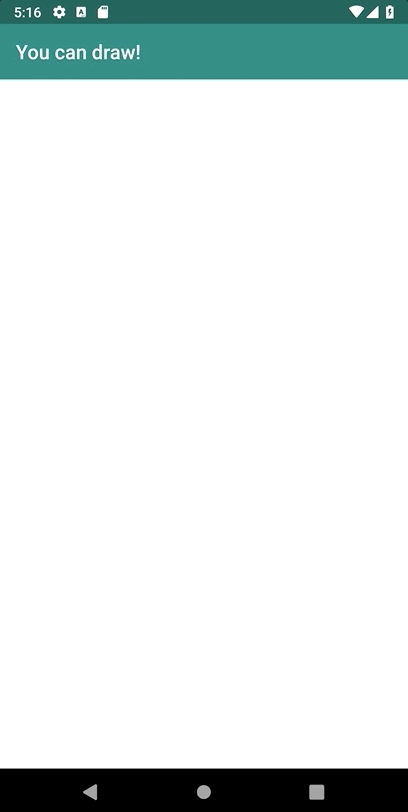

# You can draw!

Hey everyone!

I made this app to show how simple is to capture user input and draw something on screen using Kotlin =)

<p align="center">
    
</p>

## How does it work?

Basically this app has needs two things to work:

1. Capture user input
2. Draw on the screen

### 1. Capturing the user input

To capture the user finger, over the drawing area, we use the `View.setOnTouchListener`:

```
userCanvasView.setOnTouchListener { _, event ->
    ...
}
```

Now with the `event: MotionEvent` we create a useful extension function to retreive the `X,Y` touch coordinates with:

```
private fun MotionEvent.getPointer(): Pair<Int, MotionEvent.PointerCoords> {
    val pointerId: Int = this.getPointerId(this.actionIndex)
    val pointerCoords = MotionEvent.PointerCoords()
    this.getPointerCoords(pointerId, pointerCoords)
    return Pair(pointerId, pointerCoords)
}
```

Handling the touch event more properly, we want to draw only when the user has touched the screen (`MotionEvent.ACTION_DOWN`) or moved his finger while touching (`MotionEvent.ACTION_MOVE`).

Now your `userCanvasView.setOnTouchListener` looks like:

```
userCanvasView.setOnTouchListener { _, event ->
    when (event.actionMasked) {
        MotionEvent.ACTION_DOWN, MotionEvent.ACTION_MOVE -> {
            printPointerLocation(event)
            draw(event)
        }
    }
    true
}
```

### 2. Draw on the screen

This is the trickiest part from this app and yet simple!

For starters, we will use three things to draw something:

1. Paint:

    **What we will draw**

    The paint object contains parameters like Color, Stroke, Stroke width, and so on!

    ```
    val paint by lazy {
        val paint = Paint()
        paint.isAntiAlias = true
        paint.color = Color.BLACK
        paint.style = Paint.Style.STROKE
        paint.strokeJoin = Paint.Join.ROUND
        paint.strokeWidth = 10f
        paint
    }
    ```

2. Bitmap:

    **Where we will drawn**

    As you probably now, the `Bitmap` is a image object with we can associate to our ImageView.

    To create a Bitmap we need its `width`, `height` and its configuration (`Bitmap.Config`)

    We can create the `Bitmap` with:

    ```
    val bitmap by lazy {
        Bitmap.createBitmap(userCanvasView.width, userCanvasView.height, Bitmap.Config.ARGB_8888)
    }
    ```
    In our layout we have the following `ImageView`:
    ```
    <ImageView
        android:id="@+id/userCanvasView"
        android:layout_width="match_parent"
        android:layout_height="match_parent"
        android:scaleType="fitXY"/>
    ```
    To show the `Bitmap` on the `ImageView` we do the following:
    ```
    userCanvasView.setImageBitmap(bitmap)
    ```
    Almost everything ready by now! We just need to define the `Canvas` wich will allow us to draw in the `Bitmap`.

3. Canvas

    **Links what and where we want to draw**

    The `Canvas` is responsible to link the `Paint` and the `Bitmap`.

    To setup the `Canvas` we just need to:
    ```
    val canvas by lazy {
        Canvas(bitmap)
    }
    ```
    Yep! Simple like that!

    Finally, we can draw something on that canvas! To do so:
    ```
    canvas.drawPoint(pointerCoords.x, pointerCoords.y, paint)
    ```

## TODO
- [] Make this a component
- [] Allow the user to change the `Paint` attributes
- [] Draw lines between current and last input
